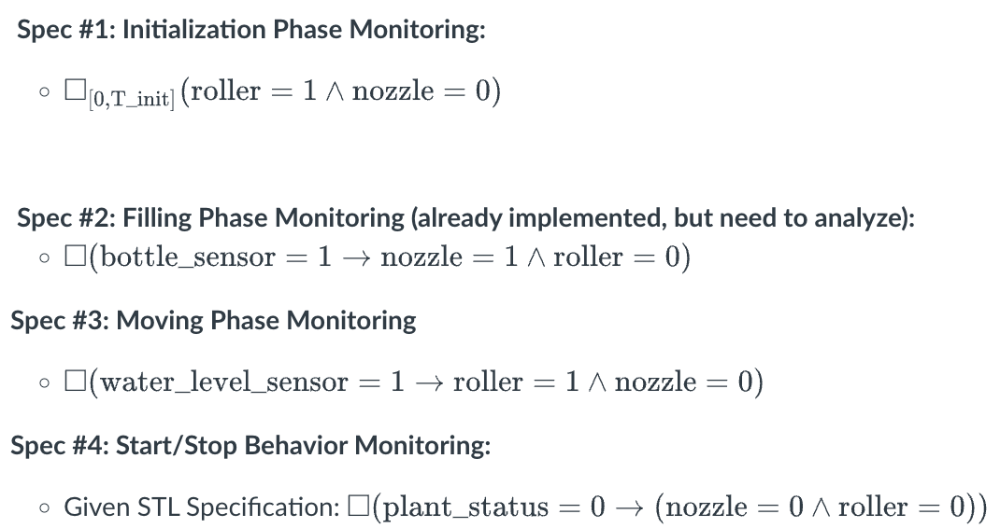

# Attacking ICS pants and STL spec monitoring on cs6963!!!

## Task 1: Industrial Control System Capture-the-Flag Exercises

This folder starts right after you finish the following CTFs on TryHackMe.

- [Attacking ICS Plant #1](https://tryhackme.com/room/attackingics1)
- [Attacking ICS Plant #2](https://tryhackme.com/room/attackingics2)

The 'scripts' folder contains some python files attacking a ICS plant using Modbus protocol you can run on TryHackMe's ICS plants.

> **Important Note:** The mapping of registers in Attacking ICS Plant #1 is incorrect. Exercise caution. More on this in the report.

## Task 2: Monitoring STL Properties of the ICS Traces

In this task, you will work with the RTAMT library (Github repo and documentation [here](https://github.com/nickovic/rtamt)) to develop an STL monitor for the first TryHackMe ICS (the bottle filling station).

- Task_2/generate.py: This script interacts with the bottle filling simulator to generate traces of the holding register values from the bottle filling station simulator in a format that is readable by the provided monitor script. Each trace also has a timestamp. The output is a file titled "traces.txt." This is essentially a modified version of the discovery script provided in the first ICS.
  - Usage: python3 generate_traces.py &lt;Bottle Filling Station IP Address&gt; &lt;trace duration in seconds&gt;
- Task_2/samplemonitor.py": STL monitor script that uses the RTAMT library to evaluate whether the recorded traces in the "traces.txt" file against an STL spec. There are several todos in this script to evaluate the different STL properties in the below instructions. Spec has been implemented. The output is the robustness values provided by the RTAMT library.
  - Usage: python3 samplemonitor.py

Instructions:

- Use the "generate_traces.py" script to generate a signal trace of at least 60 seconds long.
- Write your monitor script which will use the generated traces for the following specs to find the robustness value when there's no attack. 

  
  

- Now run any of the attack from the script folder, generate the trace file, write the a monitor to find the robustness for any of the specifications.

## Task 3: Build Your First PLC Program

This task is simply to familiarize yourself with one programming language for PLCs (structured text) and the OpenPLC environment (which will be used in the live CTF). A single PLC project is included in the folder "Task3Files".

The OpenPLC IDE simulates how PLCs are actually programming using real code that can run on PLCs. There are several programming languages for PLCs, the most popular being ladder logic and structured text (which is similar to Pascal). OpenPLC uses the [Matiec compiler](https://github.com/nucleron/matiec) to an external site. on the backend to generate C code that represents the PLC program you wrote, which is then compiled to a target runtime (e.g., an Arduino, a Raspberry Pi, etc.).

Instructions:

- Install OpenPLC(Follow official docs)
- Load the given Task3Files/plc.xml file and compile to inspect the generated c files. The output generated st is generated.st
