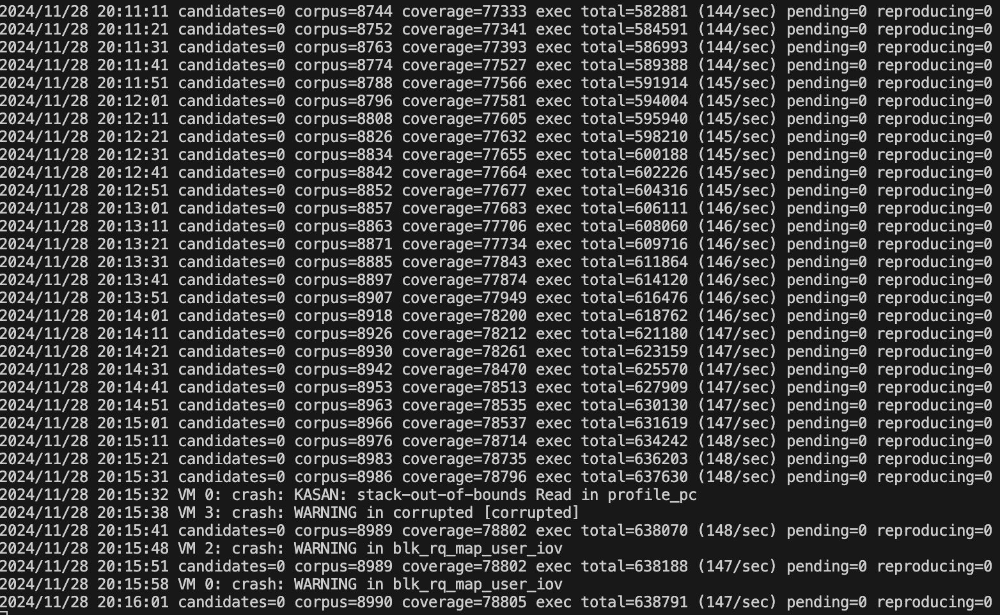
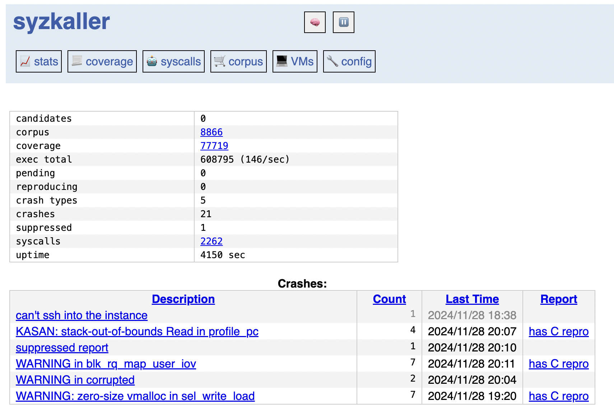

# KerFuzz: A Virtualized Environment for Kernel Fuzzing

KerFuzz is a setup designed for fuzzing the Linux kernel using tools like QEMU and syzkaller. This document outlines the steps to prepare, configure, and build a Linux kernel tailored for fuzzing.

---

## **Steps to Set Up the Kernel**

### 1. Clone the Linux Kernel Source

Create a project directory and clone the Linux kernel repository:

```bash
mkdir KerFuzz
cd KerFuzz
git clone --branch v6.2 git://git.kernel.org/pub/scm/linux/kernel/git/torvalds/linux.git .
```

### 2. Set Up the Kernel Configuration

Generate a default configuration:

```bash
make defconfig
```

Open the configuration menu to configure the kernel:

```bash
make menuconfig
```

---

### 3. Enable Necessary Debugging and Fuzzing Features

By pressing `space` tab, enable the following features in the kernel configuration:

#### **General Debugging Options**:

- **Debug Filesystem**:
  ```
  Kernel hacking  --->
      [*] Debug filesystem (CONFIG_DEBUG_FS)
  ```

#### **Fuzzing-Specific Features**:

- **Kernel Coverage (KCOV)**:

  ```
  Kernel hacking  --->
      [*] Kernel coverage tracking (CONFIG_KCOV)
  ```

  - Enable `Comparison tracking` for KCOV:
    ```
    [*] Enable comparison tracking (CONFIG_KCOV_ENABLE_COMPARISONS)
    ```

- **Kernel Address Sanitizer (KASAN)**:

  ```
  Kernel hacking  --->
      Memory Debugging  --->
          [*] KASAN: runtime memory debugger (CONFIG_KASAN)
  ```

  - Enable `Outline mode` for KASAN:
    ```
    [*] KASAN: outline instrumentation (CONFIG_KASAN_OUTLINE)
    ```

- **Fault Injection Framework**:
  ```
  Kernel hacking  --->
      [*] Fault injection framework (CONFIG_FAULT_INJECTION)
  ```

#### **Optional Debugging Enhancements**:

- **Lock Debugging**:

  ```
  Kernel hacking  --->
      [*] Lock debugging: detect incorrect locking usage (CONFIG_DEBUG_LOCKING_API_SELFTESTS)
  ```

- **Memory Debugging Enhancements**:
  ```
  Kernel hacking  --->
      Memory Debugging  --->
          [*] Debug memory initialisation (CONFIG_DEBUG_PAGEALLOC)
  ```

#### **Minimal Virtualization Support for QEMU**:

- **VirtIO Drivers**:
  ```
  Device Drivers  --->
      [*] Virtio drivers (CONFIG_VIRTIO)
          [*] PCI transport for VirtIO (CONFIG_VIRTIO_PCI)
          [*] VirtIO balloon driver (CONFIG_VIRTIO_BALLOON)
          [*] VirtIO input driver (CONFIG_VIRTIO_INPUT)
  ```

#### **File Systems**

To resolve `/sys/kernel/config` issues or dependencies:

- **Add this line to the configuration**:
  ```plaintext
  CONFIG_CONFIGFS_FS=y
  ```

#### KVM Support for Virtualization

- **KVM Core and Architecture Support**:

Make sure what the CPU architecture of the working machine by runnint `lscpu` command.

```
Virtualization  --->
    [*] Kernel-based Virtual Machine (KVM) support (CONFIG_KVM)
    [*] KVM for Intel processors (CONFIG_KVM_INTEL)
```

---

### 4. Build the Kernel

Compile the kernel using all available processor cores:

```bash
make -j$(nproc)
```

---

## **Kernel Output**

Once the build completes, the kernel image can be found at `linux-6.2/arch/x86/boot/bzImage`

This kernel image is ready to be used in QEMU or other virtualization environments for fuzzing system calls or other kernel features.

Ensure the `vmlinux` file is created in the root of the kernel source directory.

---

## **Steps to Set Up syzkaller**

### 1. Clone and Build Syzkaller:

```bash
git clone https://github.com/google/syzkaller.git
cd syzkaller
make
cd ..
```

### 2. Set Up the Root Filesystem

- **Prepare a Directory for Rootfs Images on the project root directory**:

```bash
mkdir syzkaller_images
cd syzkaller_images
export IMAGES=$(pwd)
```

- **Run the Rootfs Image Creation Script**:

```bash

# From inside the syzkaller_images directory, the following script will create the required file system image
bash syzkaller/tools/create-image.sh

# Check if the Image Exists
ls -lh bullseye.img

# Inspect the Contents of the Image
sudo mount -o loop bullseye.img /mnt/bullseye
ls /mnt/bullseye
sudo umount /mnt/bullseye
```

At this point, the current project directory would be:

### Directory and File Overview

```
KerFuzz/
├── linux-6.2               # Linux kernel source code (version 6.2)
├── README.md               # Project documentation
├── syzkaller               # Syzkaller repository (cloned and built)
└── syzkaller_images        # Directory for rootfs images and related files
    ├── bullseye            # Temporary directory used during rootfs creation
    ├── bullseye.id_rsa     # SSH private key for accessing the QEMU virtual machine
    ├── bullseye.id_rsa.pub # SSH public key for accessing the QEMU virtual machine
    └── bullseye.img        # Root filesystem image for QEMU (Debian-based)
```

### What is bullseye.img?

- It is a Debian-based filesystem image (in this case, "Bullseye" refers to the Debian release).
- It contains:
  - A minimal Debian operating system.
  - Essential tools like ssh, curl, and others specified in the create-image.sh script.
  - An SSH server, which is crucial for syzkaller to communicate with the virtual machine.
- It acts as the "operating system" that runs inside the QEMU virtual machine, providing an environment for the kernel to execute.

Now, the next step is to test the QEMU boot with the root filesystem and configure Syzkaller for fuzzing.

### Step 1: Command to Boot QEMU with Kernel and Image

Run the following command from your KerFuzz project directory to boot the QEMU VM with the specified kernel and root filesystem:

```bash
qemu-system-x86_64 \
    -m 2G \
    -smp 2 \
    -kernel linux-6.2/arch/x86/boot/bzImage \
    -append "console=ttyS0 root=/dev/sda earlyprintk=serial net.ifnames=0" \
    -drive file=syzkaller_images/bullseye.img,format=raw \
    -net user,host=10.0.2.10,hostfwd=tcp:127.0.0.1:10021-:22 \
    -net nic,model=e1000 \
    -enable-kvm \
    -nographic \
    -pidfile vm.pid \
    2>&1 | tee vm.log
```

#### Potential Issues and Resolutions After Running the QEMU Command

<details>
<summary><strong>1. Kernel Fails to Boot</strong></summary>

#### Cause:

Missing kernel configuration options, corrupted `bzImage`, or incompatible kernel version.

#### Resolution:

- Ensure necessary kernel options (e.g., CONFIG_DEBUG_FS, CONFIG_KCOV, CONFIG_CONFIGFS_FS) are enabled.
- Rebuild the kernel:
  ```bash
  make clean && make -j$(nproc)
  ```
- Confirm the `bzImage` file exists:
  ```bash
  ls linux-6.2/arch/x86/boot/bzImage
  ```
  </details>

<details>
<summary><strong>2. Emergency Mode or Boot Errors</strong></summary>

#### Cause:

Incorrect root filesystem (`bullseye.img`) configuration or missing files.

#### Resolution:

- Mount and inspect the QEMU image:
  ```bash
  sudo mount -o loop syzkaller_images/bullseye.img /mnt
  ```
- Fix missing files or configurations, then unmount:
  ```bash
  sudo umount /mnt
  ```

</details>

<details>
<summary><strong>3. No Network Connectivity in the VM</strong></summary>

#### Cause:

`eth0` interface not configured, renamed, or missing kernel modules.

#### Resolution:

- Inside the VM, check available interfaces:
  ```bash
  ip link
  ```
- If `eth0` is missing but another interface (e.g., `enp0s3`) exists, rename it:
  ```bash
  ip link set enp0s3 name eth0
  ```
- Then bring up the interface:
  ```bash
  ifup eth0
  ```
- Load the appropriate network driver (e.g., `e1000`):
  ```bash
  modprobe e1000
  ```

</details>

<details>
<summary><strong>4. SSH Connection Fails</strong></summary>

#### Cause:

SSH server not running or port forwarding misconfigured.

#### Resolution:

- Ensure SSH server is running:
  ```bash
  service ssh status
  ```
- Restart SSH if necessary:
  ```bash
  service ssh restart
  ```
- Confirm port forwarding:
  ```bash
  -net user,hostfwd=tcp:127.0.0.1:10021-:22
  ```
- Test SSH with verbose output:
  ```bash
  ssh -vvv -i syzkaller_images/bullseye.id_rsa -p 10021 -o "StrictHostKeyChecking no" root@localhost
  ```

</details>

<details>
<summary><strong>5. QEMU Performance Issues</strong></summary>

#### Cause:

Running QEMU without KVM or insufficient resources.

#### Resolution:

- Ensure `-enable-kvm` is included in the QEMU command.
- Verify KVM support:
  ```bash
  lsmod | grep kvm
  ```
- Allocate sufficient memory and CPU to the VM:
  ```bash
  -m 2G -smp 2
  ```

</details>

<details>
<summary><strong>6. Console Output Stuck or Blank</strong></summary>

#### Cause:

Incorrect kernel boot parameters or missing serial console configuration.

### Resolution:

- Ensure `console=ttyS0` is passed in the `-append` option.
- Use `earlyprintk=serial` for debugging boot issues.

</details>

<details>
<summary><strong>7. File System Mounting Issues</strong></summary>

#### Cause:

Missing `configfs` support or improperly configured `/etc/fstab`.

### Resolution:

- Verify `/sys/kernel/config` is mounted:
  ```bash
  mount | grep configfs
  ```
- Enable `CONFIG_CONFIGFS_FS` in the kernel configuration and rebuild.

</details>

### Step 2: SSH Access to the QEMU VM

After starting the QEMU VM, you can access it via SSH from another terminal. Use the following command:

```bash
ssh -vvv -i syzkaller_images/bullseye.id_rsa -p 10021 -o "StrictHostKeyChecking no" root@localhost
```

#### Shutting Down QEMU VM and Exiting SSH Connection

```bash
# To exit SSH connection: in the other terminal
exit

# To shutdown the QEMU VM, in the QEMU terminal (the one running the qemu-system-x86_64 command), press:

Ctrl+A, then X

# Or from another terminal

kill $(cat vm.pid)

# Or Ensure that ACPI is enabled in the kernel configuration (typically it is by default): in QEMU VM terminal
poweroff
```

#### SSH Connection Issue: "Too many tries"

If SSH fails with the error `too many tries`, it may be due to SSH attempting default keys before using the one explicitly passed with `-i`. To resolve this, add the `IdentitiesOnly` option:

```bash
ssh -vvv -i syzkaller_images/bullseye.id_rsa -p 10021 -o "StrictHostKeyChecking no" -o "IdentitiesOnly yes" root@localhost
```

Now that you have a working Syzkaller build and your QEMU VM is functional, the next steps would involve configuring and running Syzkaller to start fuzzing the kernel.

### Prepare a syzkaller configuration json file for KerFuzz

- Create a work directory named `KerFuzz_wd`

```bash
mkdir KerFuzz_wd
```

- We will create `KerFuzz_config.json` file with the following configuration. Please, modify the paths based on your setup and provide the absolute paths if needed.

```json
{
  "target": "linux/amd64",
  "http": "127.0.0.1:56741",
  "workdir": "/home/yeaseen/KerFuzz/KerFuzz_wd",
  "kernel_obj": "/home/yeaseen/KerFuzz/linux-6.2",
  "image": "/home/yeaseen/KerFuzz/syzkaller_images/bullseye.img",
  "sshkey": "/home/yeaseen/KerFuzz/syzkaller_images/bullseye.id_rsa",
  "syzkaller": "/home/yeaseen/KerFuzz/syzkaller",
  "procs": 8,
  "type": "qemu",
  "vm": {
    "count": 4,
    "kernel": "/home/yeaseen/KerFuzz/linux-6.2/arch/x86/boot/bzImage",
    "cmdline": "net.ifnames=0",
    "cpu": 2,
    "mem": 2048
  }
}
```

### Run syzkaller

```bash
syzkaller/bin/syz-manager -config KerFuzz_config.json
```

It will provide real-time output in the terminal and generate reports and logs in the specified workdir directory (e.g., `KerFuzz_wd`) as defined in the `KerFuzz_config.json` file.

At this point, the project folder overview would be the following:

```
KerFuzz/
├── KerFuzz_config.json # Configuration file for syzkaller manager
├── KerFuzz_wd # Working directory for syzkaller (stores corpus, logs, etc.)
├── linux-6.2 # Linux kernel source code (version 6.2)
├── README.md # Project documentation
├── syzkaller # Syzkaller repository (cloned and built)
├── syzkaller_images # Directory for rootfs images and related files
│ ├── bullseye # Temporary directory used during rootfs creation
│ ├── bullseye.id_rsa # SSH private key for accessing the QEMU virtual machine
│ ├── bullseye.id_rsa.pub # SSH public key for accessing the QEMU virtual machine
│ └── bullseye.img # Root filesystem image for QEMU (Debian-based)
└── vm.log # Log file for QEMU virtual machine
```

## Syzkaller Outputs

### 1. Syzkaller Terminal Running

The following image shows the Syzkaller manager running in the terminal, displaying progress updates including corpus size, coverage, and execution rate:

<p align="center">
  
</p>

---

### 2. Syzkaller Stats (HTML Output)

The following image displays the Syzkaller statistics page, accessible via the web interface at `http://127.0.0.1:56741/`. It provides real-time updates on metrics such as total executions, crashes, and coverage:

<p align="center">
  
</p>
