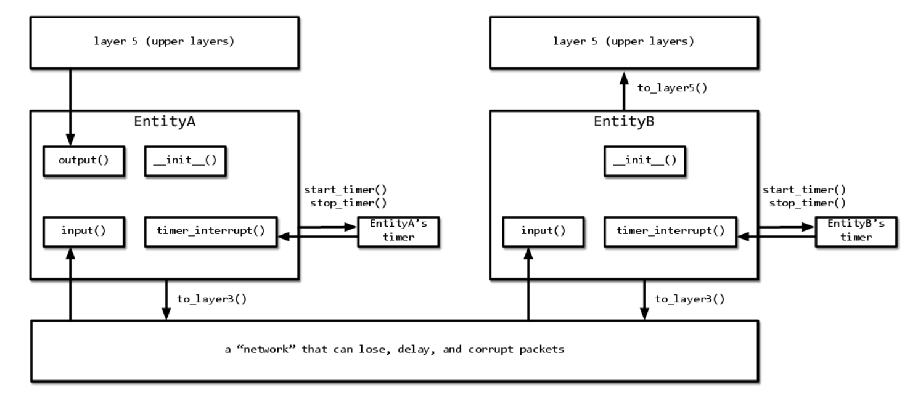

# TCP code for implementing a simple reliable data-transfer protocol via Go-Back-N protocol.

  

Commands:

- 101.1) Test run under 10 messages - `python3 rdtsim.py -n 10 -d 100 -z 2 -l 0 -c 0 -s 2121212121`
- 101.2) Test run under 100 messages - `python3 rdtsim.py -n 100 -d 100 -z 2 -l 0 -c 0 -s 686868686`
- 101.3) Test run under 1000 messages - `python3 rdtsim.py -n 1000 -d 100 -z 2 -l 0 -c 0 -s 7567575757`
- 101.4) Test run under 10000 messages - `python3 rdtsim.py -n 10000 -d 100 -z 2 -l 0 -c 0 -s 474747474747`
- 102.1) Test run under 1000 messages with interarrival time of 10 - `python3 rdtsim.py -n 1000 -d 10 -z 2 -l 0 -c 0 -s 3838383838`
- 102.2) Test run under 10000 messages with interarrival time of 10 - `python3 rdtsim.py -n 10000 -d 10 -z 2 -l 0 -c 0 -s 45050505050`
- 103.1) Test run under 1000 messages with loss of 1% - `python3 rdtsim.py -n 1000 -d 100 -z 2 -l 0.01 -c 0 -s 67676768889`
- 103.2) Test run under 1000 messages with loss of 5% - `python3 rdtsim.py -n 1000 -d 100 -z 2 -l 0.05 -c 0 -s 57575757578`
- 103.3) Test run under 1000 messages with loss of 10% - `python3 rdtsim.py -n 1000 -d 100 -z 2 -l 0.01 -c 0 -s 58858588855`
- 104.1) Test run under 1000 messages with corruption of 1% - `python3 rdtsim.py -n 1000 -d 100 -z 2 -l 0 -c 0.01 -s 102929229`
- 104.2) Test run under 1000 messages with corruption of 5% - `python3 rdtsim.py -n 1000 -d 100 -z 2 -l 0 -c 0.05 -s 129019191911`
- 104.3) Test run under 1000 messages with corruption of 10% - `python3 rdtsim.py -n 1000 -d 100 -z 2 -l 0.0 -c 0.1 -s 2626262626262`
- 105.1) Test run under 10000 messages with loss 1% and corruption 1% - `python3 rdtsim.py -n 10000 -d 100 -z 2 -l 0.01 -c 0.01 -s 4734747747`
- 105.2) Test run under 10000 messages with loss 10% and corruption 10% - `python3 rdtsim.py -n 10000 -d 100 -z 2 -l 0.1 -c 0.1 -s 595959595959`
- 106.1) Test run under 10000 messages with short interarrival time of 10 and loss 1% - `python3 rdtsim.py -n 10000 -d 10 -z 2 -l 0.01 -c 0 -s 3434343434`
- 106.2) Test run under 10000 messages with short interarrival time of 10 and loss 10% - `python3 rdtsim.py -n 10000 -d 10 -z 2 -l 0.1 -c 0 -s 58585858585`
- 107.1) Test run under 10000 messages with short interarrival time of 10 and corruption 1% - `python3 rdtsim.py -n 10000 -d 10 -z 2 -l 0 -c 0.01 -s 78787878787`
- 107.2) Test run under 10000 messages with short interarrival time of 10 and corruption 10% - `python3 rdtsim.py -n 10000 -d 10 -z 2 -l 0 -c 0.1 -s 505050550505`
- 108.1) Test run under 10000 messages with short interarrival time of 10. Corruption and Loss both 1% - `python3 rdtsim.py -n 10000 -d 10 -z 2 -l 0.01 -c 0.01 -s 204920492049`
- 108.2) Test run under 10000 messages with short interarrival time of 10. Corruption and loss both 5% - `python3 rdtsim.py -n 10000 -d 10 -z 2 -l 0.05 -c 0.05 -s 207720772077`
- 108.3) Test run under 10000 messages with short interarrival time of 10. Corruption and loss both 10% - `python3 rdtsim.py -n 10000 -d 10 -z 2 -l 0.1 -c 0.1 -s 202020202020`
