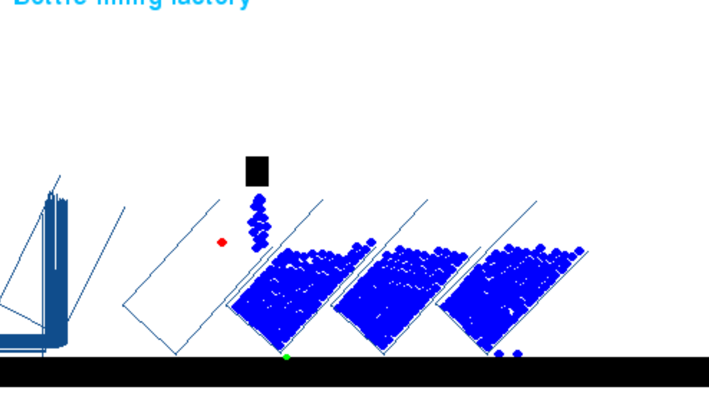

# Task 1: Industrial Control System Capture-the-Flag Exercises

## CTF-1: Attacking ICS Plant #1

### Task 1: Introduction to OT/ICS

No answer needed.

### Task 2: Introduction to Modbus protocol

- **Question:**
  - Which is the function used to read holding registers in pymodbus library?
    - _Answer:_ `read_holding_registers`
  - Which is the function used to write holding registers in pymodbus library?
    - _Answer:_ `write_register`

### Task 3: Discovery

- **Questions:**
  - How many phases can we observe?
    - _Answer:_ 3
  - How many sensors can we observe?
    - _Answer:_ 2
  - How many actuators can we observe?
    - _Answer:_ 3
  - Using the script discovery.py, how many registers can we count?
    - _Answer:_ 16
  - After the plant is started and a bottle is loaded, how many registers are continuously changing their values?
    - _Answer:_ 4
  - Which is the minimum observed value?
    - _Answer:_ 0
  - Which is the maximum observed value?
    - _Answer:_ 1
  - Which registry is holding its value?
    - _Answer:_ 16
  - Which registries are set to 1 while the nozzle is filling a bottle?
    - _Answer:_ 2, 4
  - Which registries are set to 1 while the roller is moving the bottles?
    - _Answer:_ 1, 3
  - Which is the color of the water level sensor?
    - _Answer:_ red
  - Which is the color of the bottle sensor?
    - _Answer:_ green
  - If you observe the plant at the very beginning, which is the registry associated with the roller?
    - _Answer:_ 3
  - Based on the previous answer, which is the registry associated with the water level sensor?
    - _Answer:_ 1

### Task 4: Play to learn

- **Question:**
  - Which is the registry associated with the nozzle?
    - _Answer:_ 4

### Task 5: Attack

- Just the scripts file to generate the attacks and capture the moments if you want.
- A image after running attack_shutdown.py.

  

## CTF-2: Attacking ICS Plant #2

### Task 1: Discovery

No answer needed.

### Task 2: Flag #1

Read flag1.txt: 0df2936b4cfbd5ce3ae91ef7021d925a

### Task 3: Flag #2

Read flag2.txt: fdee450ac6627276d115dd905a256d49

## Reflection Part

### Question:

What is the fundamental vulnerability of these systems that you are exploiting, and how would you mitigate this vulnerability in the real world?

### Answer:

**Vulnerability:** The openness of the Plant's Network to the outside network, in my estimation, is the fundamental vulnerability. Besides, whenever I used a script to change any registry value, I didn't have to face any authentication or access control system at all. This might be because the Plant system lacks recent security updates and patches.

**Mitigation:** I think there should be some access/authentication protocol to be passed successfully whenever anyone tries run any srcipt file on the IP address of the ICS network. Also, all the softwares and firmwares in the ICS should regularly be up-to-date with the lastest security patches. From the angle of Network Security, a firewall or network intrusion detector should be installed to monitor the incoming and outgoing traffic and to detect unusal behaviors.

# Task 2: Monitoring STL Properties of the ICS Traces

- The correct Mapout of the registers from the simulation:
  [The Registrers Descriptions are wrong in the TryHackMe's (Attacking ICS Plant #1) webpage]
  The correct Mapout of the registers from the simulation:
  Registry 1: Associated with the bottle sensor. Value is 0 when bottle is under the nozzle. Value is 1 when roller is moving and bottle isn't under the nozzle.

      		Registry 2: Associated with the water level sensor. Value is 1 until the bottle is filled. Value is 0 when the bottle is full.

      		Registry 3: Associated with the roller actuators. Value 0 when roller is stopped and water is being filled. Value is 1 when roller is moving.

      		Registry 4: Associated with the nozzle. Value 1 when the water is being filled and nozzle is open. Value 0 when bottle is fully filled and nozzle is closed.

      		Registry 16: Associated with the plant. Value 1 starts the plant. And I got Value 2 after some time.

      		From the simulation we always get the following two situations :
      			When the roller is moving and bottle isn't under the nozzle: we always get [  bottle_sensor = 1, water_level_sensor = 0, roller_sensor = 1, nozzle_sensor = 0 ]
      			When the roller is stopped and the water is being filled: we always get [ bottle_sensor = 0, water_level_sensor = 1, roller_sensor = 0, nozzle_sensor = 1 ]

      				The specification could be: When the bottle_sensor is 1 meaning the bottle is not under the nozzle, the roller is moving with roller_sensor=1 and the nozzle is closed with nozzle_sensor=0.
      								Always((bottle_sensor == 1) implies ((roller_sensor==1) and (nozzle_sensor==0)))

      				The specification could be: When the water_level_sensor is 1 meaning the bottle is being filled, the roller is stopped with roller_sensor=0 and the nozzle is open with nozzle_sensor=1.
      								Always((water_level_sensor == 1) implies ((roller_sensor==0) and (nozzle_sensor==1)))

      				The above specifications defy your provided spec2 and spec3, respectively. It is because the registers descriptions are wrong on the TryHackMe website.

- Trace files:

  - Benign: traces.txt
  - Malicious:
    - traces_attack_move_fill2.txt (based on attack_move_fill2.py)
    - traces_anomaly_attack_shutdown.txt (based on attack_shutdown.py)

- Monitor files:

  - samplemonitor.py: contains functions to calculate the robustness for benign trace file.
  - anomalymonitor.py: contains a function to calculate the robustness for spec2 from malicious trace files.

- For monitoring the benign trace file: sampolmonitor.py

  - Output Robustness of spec1:

    - Robustness of Initialization Phase Monitoring: [[0, -0.0], [57.940584897994995, -1.0], [58.65449070930481, -1.0]]
    - _Opinion:_ Anticipate a lag in the first timestamp data.

  - Output Robustness of spec2:

    - Robustness of Filling Phase Monitoring: [[0.15729808807373047, 0.0], [58.81263589859009, 1.0], [59.5265417098999, 1.0]]
    - _Opinion:_ Robustness changes from 0.0 to 1.0 at 58.81263589859009 timestamp.

  - Output Robustness of spec3:

    - Robustness of Moving Phase Monitoring: [[0.15729808807373047, 0.0], [59.5265417098999, 0.0]]
    - _Opinion:_ No change in robustness.

  - Output Robustness of spec4:
    - Robustness of Start/Stop Behavior Monitoring: [[0.15729808807373047, 1.0], [59.5265417098999, 1.0]]
    - _Opinion:_ No change in robustness.

- Monitor robustness of traces_attack_move_fill2.txt for spec2 by anomalymonitor.py:

  - Robustness of Filling Phase Monitoring: [[0.15912604331970215, 1.0], [59.87752914428711, 1.0]]
  - _Opinion:_ No change in robustness.

- Monitor robustness of traces_anomaly_attack_shutdown.txt for spec2 by anomalymonitor.py:

  - Robustness of Filling Phase Monitoring: [[0.19319605827331543, 1.0], [59.663679361343384, 1.0]]
  - _Opinion:_ No change in robustness.

- Attacked Scenario: I got the attacked scenario and attack_shutdown.png is attached herewith.

# Task 3: Build Your First PLC Program

1. **Difference between program0.st and output.st:**

   - The input program0.st file which I can understand easily and write the logic on in the PLC editor. When I compile the input st file, it creates the output.st file which the PLC hardware can execute efficiently. And, the output.st file contains all the necessary variables, structured text codes and configurations.

2. **Config0.c:**

   - The file contains code responsible for initializing the overall system and setting up essential components before the main PLC program starts executing.

3. **POUS.c:**

   - In this file, I found the translated C version of the logic functions written in the program0.st file.

4. **Res0.c:**

   - This file has some resource allocation function within which the configuration functions are called from the config.h file.

5. **plc_main.c:**
   - In OpenPLC, the plc_main.c file is a C language file that serves as the main entry point for the execution of the compiled PLC program. It interacts with POUS.c, Config0.c and Res0.c files. So plc_main.c is the system level language file. The OpenPLC can execute the binary output, plc_main.o, file execute the program I wrote in the program0.st file.
