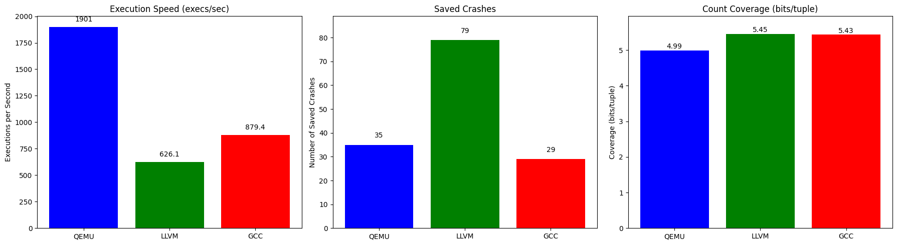

# AFL++ Fuzzing Modes Evaluation Report

**To regenerate this follow the Makefile**

**You might come accross the Kernel issue, run setup_fuzz.sh with execution power**

## Introduction

This report provides an evaluation of fuzzing the fuzzgoat application with AFL++ in various modes: LLVM instrumentation, GCC instrumentation (Normal mode), and QEMU mode (binary-only fuzzing). The purpose is to compare the effectiveness of these modes in terms of execution speed, code coverage, and crash discovery.

## Methodology

Fuzzing was conducted with AFL++ using the following configurations:

- **LLVM Mode:** Instrumentation via `afl-clang-fast` for LLVM-based coverage.
- **Normal Mode:** Instrumentation via `afl-gcc` for GCC-based coverage.
- **QEMU Mode:** Binary-only fuzzing on a GCC-compiled fuzzgoat binary.

The metrics used for evaluation were:

- Execution Speed (execs/sec)
- Code Coverage (map density and count coverage)
- Crash Discovery (total and unique crashes)

The aim was to determine how these modes affect the fuzzing process and to explore potential synergies between them.

## Results

The following graphs illustrate the differences in execution speed, saved crashes, and count coverage across the three modes:

The results show that:

- QEMU Mode had the highest execution speed but lower code coverage.
- LLVM Mode discovered the most crashes with the highest code coverage but at a slower execution speed.
- Normal Mode offered a balance between the two in terms of speed and crash discovery.

## Conclusion

Each fuzzing mode has its advantages depending on the goals of the fuzzing session. LLVM mode is suited for in-depth analysis, QEMU mode for quick scans when source code is unavailable, and Normal mode for a balance of speed and thoroughness. These findings can inform the choice of fuzzing strategy for future security testing endeavors.
